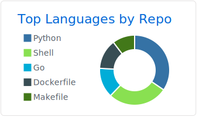
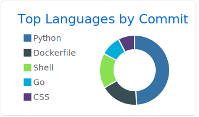
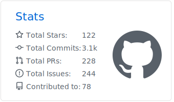

<h1> Hi there! </h1>

### Welcome to my github 

- 🔭 I’m currently working on [Zup Innovation](https://github.com/ZupIT)
- 🌱 I’m currently learning Flutter
- 👯 I’m looking to collaborate on Open Source Projects
- 🤔 I’m looking for help with Mobile Development
- 💬 Ask me about Automation Tests
- ⚡ Fun fact: Woodworker & Musician

### Languages & Tools 🛠

&nbsp;
&nbsp;
&nbsp;
&nbsp;
&nbsp;
&nbsp;
&nbsp;
&nbsp;

&nbsp;
&nbsp;
&nbsp;
&nbsp;
&nbsp;
&nbsp;
&nbsp;
&nbsp;
&nbsp;
&nbsp;
&nbsp;
&nbsp;
&nbsp;
&nbsp;

&nbsp;
&nbsp;
&nbsp;

&nbsp;
&nbsp;
🎭&nbsp;

### Analytics ⚙️
  

  
  

  
  

<!--img width="100%" src="profile-summary-card-output/github/0-profile-details.svg" />

<!-- 

 -->

<!-- 

  
  
  

 -->

<!--  -->
<!--  -->

### Let's connect ? 🤝

